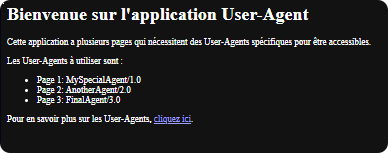
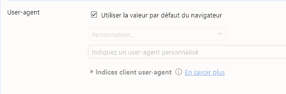

# Docker CTF - UserAgent

## Description

Un CTF pour trouver les fenelons en utilisant un User-Agent spécifique.

## Objectifs

- Découverte des Headers HTTP et des User-Agents

## Outils

- Extension Chrome: User-Agent Switcher
- PostMan: https://www.postman.com/downloads/
- Modifier les User-Agents dans Chromium:
  - Ouvrir l'inspecteur de Chrome (F12)
  - Cliquer sur les trois points en haut à droite
  - Autres outils
  - Conditions de réseau

## Protection

- Utilisation de User-Agent pour restreindre l'accès

Page 1: User-Agent de GoogleBot 	Googlebot/2.1 (+http://www.google.com/bot.html)
Page 2: User-Agent de Chrome sur Windows     Mozilla/5.0 (Windows NT 6.1) AppleWebKit/537.36 (KHTML, like Gecko) Chrome/27.0.1453.110 Safari/537.36
Page 3: Safari sur iPhone           Mozilla/5.0 (Macintosh; U; Intel Mac OS X 10_5_5; fr-fr) AppleWebKit/525.18 (KHTML, like Gecko) Version/3.1.2 Safari/525.20.1

Pour construire et démarrer votre application avec Docker Compose, utilisez les commandes suivantes dans le terminal à la racine du projet :

Construire et démarrer le conteneur :

bash
Copier le code
docker-compose up --build
Arrêter les services :

Pour arrêter les services, utilisez :

bash
Copier le code
docker-compose down
Résumé
Avec cette configuration, les valeurs FENELON1, FENELON2, et FENELON3 sont définies dans le fichier .env et injectées dans le conteneur via Docker Compose. Le conteneur exécutera l'application Node.js qui utilise ces variables pour déterminer quel User-Agent est nécessaire pour accéder aux différentes pages.