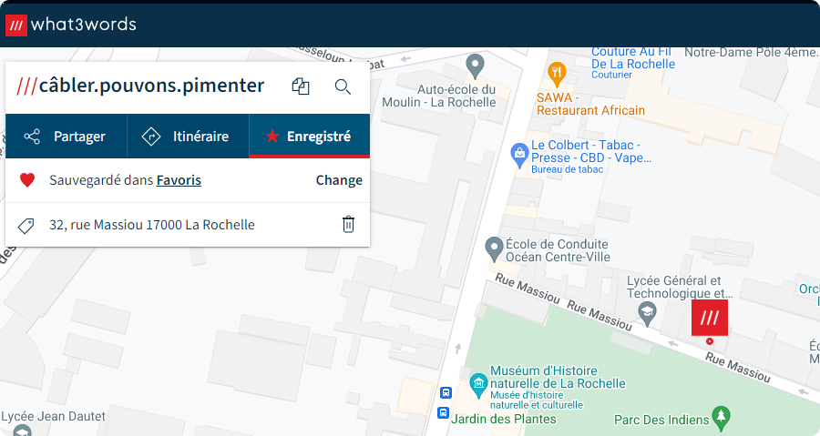

# Capture The Fenelon

Dans tous les CTF, trouvez le fichier **fenelon.txt** est une étape cruciale. 
C'est le fichier qui contient le **fenelon**.
Ce **fenelon** est la clé pour valider le challenge.

Chaque partie contient 3 **fenelon**. Ils doivent servir à trouver une localisation précise avec https://what3words.com/.

Ainsi, si les **fenelon** sont:
- câbler
- pouvons
- pimenter

La solution est: **32, rue Massiou 17000 La Rochelle**

---

## Liste des CTFs

Nom | Difficulté | Description
-- | -- | --
[1. Serveur SSH vulnérable](#1-serveur-ssh-vulnérable) | Débutant | Tester la vulnérabilité du serveur SSH et proposer des solutions pour renforcer la sécurité du serveur SSH.
[2. Prestashop vulnérable](#2-prestashop-vulnérable) | Débutant | Découvrir l'application utilisée pour le site. Tester (ou se rensigner) pour trouver les répertoires et l'accès back office. BruteForce pour se connecter sur la page d'administration.

---

## 1. Serveur SSH vulnérable

*Niveau: Débutant*

### Objectifs

Scanner les ports ouverts du serveur et trouver le port du serveur SSH.
Tester la vulnérabilité du serveur SSH et proposer des solutions pour renforcer la sécurité du serveur SSH.

---

## 2. Prestashop vulnérable

*Niveau: Débutant*

### Objectifs

Découvrir l'application utilisée pour le site.
Tester (ou se renseigner) pour trouver les répertoires et l'accès back office.
BruteForce pour se connecter sur la page d'administration.
